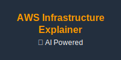
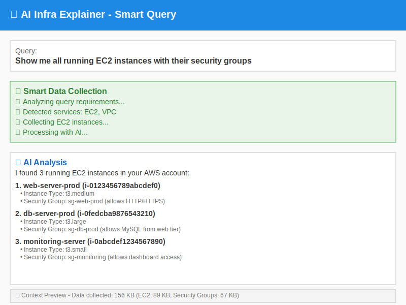
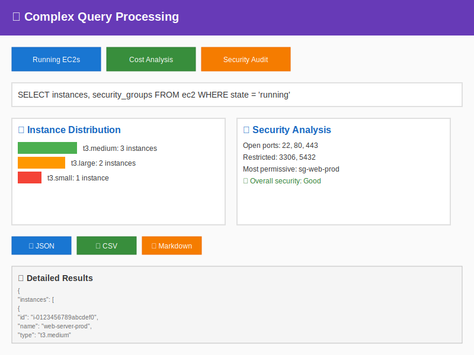
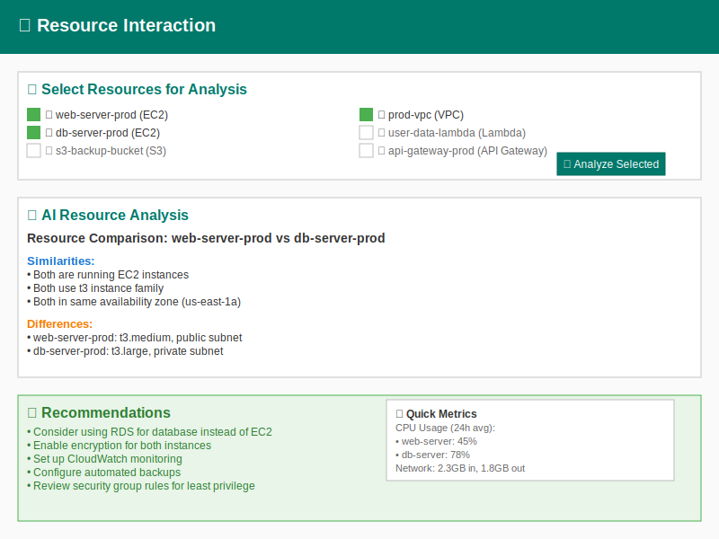
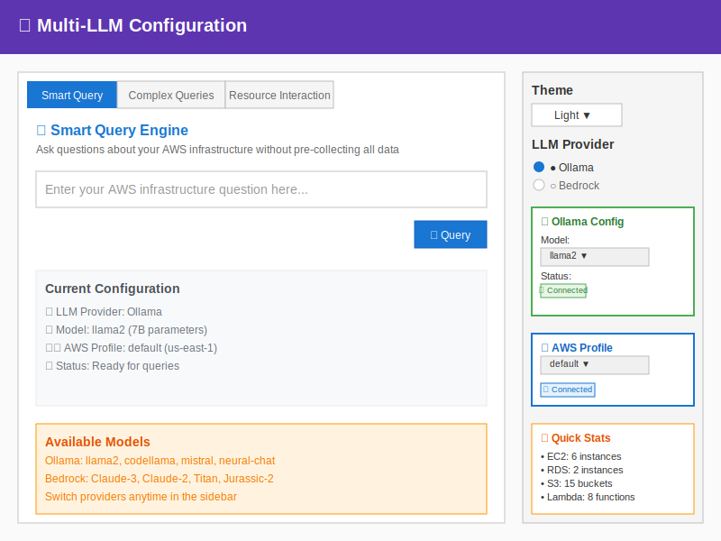

# 🧠 AWS Infrastructure Explainer

<div align="center">



**Intelligent AWS Infrastructure Analysis with AI**

[](https://opensource.org/licenses/MIT)
[](https://www.python.org/downloads/)
[](https://streamlit.io)
[](https://aws.amazon.com)

💬 **Chat with your AWS Infrastructure** | 🧠 **Local LLMs + Embeddings** | 📊 **Visual Summaries** | 📄 **Export Reports**

[🚀 Quick Start](#-quick-start) • [📖 Documentation](#-documentation) • [🎯 Features](#-features) • [🛡️ Security](#️-security--privacy) • [📚 Full Docs](docs/README.md)

</div>

---

## 📸 Screenshots

### Smart Query Engine

*Ask questions about your AWS infrastructure without pre-collecting all data*

### Complex Query Processing

*Structured queries with visualizations and export options*

### Resource Interaction

*Analyze and compare individual AWS resources with AI*

### Multi-LLM Support

*Support for both Ollama (local) and AWS Bedrock models*

---

## ✨ Key Features

### 🧠 **Smart Query Engine**
- Ask questions without pre-collecting all AWS data (avoids context overload)
- Dynamic data collection based on query analysis
- Intelligent service detection and targeted fetching

### 🎯 **Advanced Query Processing**
- **Complex Queries**: Structured queries with pattern recognition
- **Resource Interaction**: Analyze and compare individual AWS resources
- **Visualizations**: Interactive charts and graphs for query results
- **Export Options**: JSON, CSV, and Markdown export formats

### 🤖 **Multi-LLM Support**
- **Local Processing**: Ollama integration (`llama2`, `codellama`, `mistral`, etc.)
- **Cloud AI**: AWS Bedrock with Claude, Titan, and other models
- **Flexible Configuration**: Easy switching between different AI providers

### 🔐 **Enterprise Security**
- Uses AWS profiles and CLI credentials - no hardcoded secrets
- Respects existing AWS IAM permissions
- Optional local processing with Ollama
- Dynamic data fetching without persistent storage

---

## 🎯 Use Cases

| Use Case | Description | Example Query |
|----------|-------------|---------------|
| **Infrastructure Audit** | Get overview of running resources | *"Show me all running EC2 instances with their security groups"* |
| **Cost Optimization** | Identify expensive or unused resources | *"Find unused resources that are wasting money"* |
| **Security Analysis** | Check compliance and security posture | *"Which security groups allow access from anywhere?"* |
| **Resource Discovery** | Explore AWS resources across services | *"Show me all resources in my VPC"* |
| **Operational Insights** | Monitor and analyze infrastructure health | *"List all CloudWatch alarms in alarm state"* |

---

## 🚀 Quick Start

### Automated Setup (Recommended)

```bash
# Clone the repository
git clone https://github.com/your-username/Ai-infra-explainer.git
cd Ai-infra-explainer

# Run the setup script
chmod +x setup.sh
./setup.sh

# Follow the interactive prompts
```

### Manual Setup

### Prerequisites

- **Python 3.9+**
- **AWS CLI** configured with appropriate permissions
- **Ollama** (optional, for local AI) or **AWS Bedrock** access

### 1. Clone and Install

```bash
# Clone the repository
git clone https://github.com/Pran-b/Ai-infra-explainer.git
cd Ai-infra-explainer

# Install dependencies
pip install -r requirements.txt
```

### 2. Configure AWS Access

Choose one of the following methods:

#### Option A: AWS CLI (Recommended)
```bash
# Configure AWS CLI with your credentials
aws configure

# Or use AWS profiles for multiple environments
aws configure --profile dev
aws configure --profile prod
```

#### Option B: Environment Variables
```bash
export AWS_ACCESS_KEY_ID=your_access_key
export AWS_SECRET_ACCESS_KEY=your_secret_key
export AWS_DEFAULT_REGION=us-east-1
```

### 3. Set Up AI Provider

#### Option A: Local AI with Ollama
```bash
# Install Ollama
curl -fsSL https://ollama.ai/install.sh | sh

# Pull required models
ollama pull llama2
ollama pull nomic-embed-text
```

#### Option B: AWS Bedrock
- Ensure your AWS account has Bedrock access
- Enable the models you want to use in the AWS Bedrock console

### 4. Run the Application

```bash
# Start the Streamlit app
streamlit run ui-app-new.py

# Open in browser
# http://localhost:8501
```

### 5. Quick Demo (Optional)

Test the core functionality without the UI:

```bash
# Run the demo script
python demo.py

# This will test:
# - AWS connectivity
# - Data collection
# - Query analysis
# - Export functionality
```

---

## 📖 Documentation

### 🧠 Smart Query Engine

The Smart Query Engine is the core feature that eliminates context overload by intelligently analyzing your questions and fetching only the relevant AWS data.

#### How it Works:
1. **Query Analysis**: Analyzes your natural language question
2. **Service Detection**: Identifies which AWS services are needed
3. **Targeted Collection**: Fetches only the required data
4. **AI Processing**: Processes the focused dataset for faster, more accurate results

#### Example Queries:
```
"Show me running EC2 instances"
→ Only fetches EC2 data

"List all S3 buckets with public access"
→ Only fetches S3 data and analyzes bucket policies

"Find expensive RDS instances"
→ Fetches RDS data and analyzes instance types/sizes
```

### 📊 Complex Query Processing

Advanced query processing with structured outputs, visualizations, and export capabilities.

#### Supported Query Types:
- **EC2 Analysis**: Instance states, security groups, networking
- **Security Audits**: Open ports, public access, compliance checks
- **Cost Analysis**: Resource costs, optimization opportunities
- **Resource Relationships**: VPC mappings, dependencies
- **Compliance Checks**: Security standards, best practices

#### Visualization Features:
- Interactive charts and graphs
- Resource distribution analysis
- Security posture dashboards
- Cost optimization insights

### 🎯 Resource Interaction

Deep dive into individual AWS resources with AI-powered analysis.

#### Features:
- **Resource Selection**: Browse and select specific resources
- **AI Analysis**: Get detailed insights about individual resources
- **Comparison**: Compare multiple resources side-by-side
- **Recommendations**: AI-generated optimization suggestions

### 🔧 Configuration Guide

#### AWS Profiles Setup
```bash
# List available profiles
aws configure list-profiles

# Test profile connection
aws sts get-caller-identity --profile your-profile
```

#### LLM Configuration

**Ollama Models:**
- `llama2`: General purpose
- `codellama`: Code analysis
- `mistral`: Fast responses
- `llama2:13b`: Higher accuracy
- `nomic-embed-text`: Embeddings

**Bedrock Models:**
- `anthropic.claude-3-sonnet`: Advanced reasoning
- `anthropic.claude-3-haiku`: Fast responses
- `amazon.titan-text-express`: AWS native
- `ai21.j2-ultra`: High performance

---

## 🛡️ Security & Privacy

### Security Best Practices

#### ✅ **What We Do Right**
- **No Credential Storage**: Uses AWS CLI profiles and temporary credentials
- **Dynamic Data Fetching**: No persistent storage of AWS data
- **IAM Integration**: Respects your existing AWS permissions
- **Local Processing Option**: Ollama keeps data on your machine
- **Minimal Permissions**: Only requests necessary AWS permissions

#### 🔒 **Recommended IAM Policy**
```json
{
    "Version": "2012-10-17",
    "Statement": [
        {
            "Effect": "Allow",
            "Action": [
                "ec2:Describe*",
                "s3:ListBucket",
                "s3:GetBucketLocation",
                "s3:GetBucketPolicy",
                "iam:ListUsers",
                "iam:ListRoles",
                "iam:ListPolicies",
                "rds:Describe*",
                "lambda:ListFunctions",
                "lambda:GetFunctionConfiguration",
                "dynamodb:ListTables",
                "dynamodb:DescribeTable",
                "cloudformation:ListStacks",
                "ecs:ListClusters",
                "ecs:DescribeClusters",
                "eks:ListClusters",
                "eks:DescribeCluster",
                "apigateway:GET",
                "cloudwatch:DescribeAlarms",
                "logs:DescribeLogGroups"
            ],
            "Resource": "*"
        }
    ]
}
```

#### 🚨 **Security Checklist**
- [ ] AWS CLI configured with least-privilege access
- [ ] Using AWS profiles for different environments
- [ ] No hardcoded credentials in code
- [ ] Regular review of IAM permissions
- [ ] Enable CloudTrail for API call auditing

---

## 🔧 Advanced Configuration

### Environment Variables

```bash
# Optional: Override default settings
export AWS_DEFAULT_REGION=us-west-2
export STREAMLIT_SERVER_PORT=8502
export OLLAMA_BASE_URL=http://localhost:11434
```

### Custom AWS Profiles

```bash
# Development environment
aws configure set profile.dev.region us-east-1
aws configure set profile.dev.aws_access_key_id YOUR_DEV_KEY
aws configure set profile.dev.aws_secret_access_key YOUR_DEV_SECRET

# Production environment
aws configure set profile.prod.region us-west-2
aws configure set profile.prod.aws_access_key_id YOUR_PROD_KEY
aws configure set profile.prod.aws_secret_access_key YOUR_PROD_SECRET
```

### Ollama Custom Models

```bash
# Pull additional models
ollama pull codellama:13b
ollama pull mistral:7b
ollama pull llama2:70b

# List available models
ollama list
```

---

## 🤝 Contributing

We welcome contributions! Please see our [Contributing Guide](CONTRIBUTING.md) for details.

### Development Setup

```bash
# Clone the repo
git clone https://github.com/Pran-b/Ai-infra-explainer.git
cd Ai-infra-explainer

# Create virtual environment
python -m venv venv
source venv/bin/activate  # On Windows: venv\Scripts\activate

# Install development dependencies
pip install -r requirements-dev.txt

# Run tests
pytest tests/

# Run with hot reload
streamlit run ui-app-new.py --server.runOnSave true
```

### Project Structure

```
Ai-infra-explainer/
├── modules/                    # Core application modules
│   ├── aws_data_manager.py    # AWS data collection
│   ├── bedrock_manager.py     # AWS Bedrock integration
│   ├── ollama_manager.py      # Ollama integration
│   ├── dynamic_query_engine.py # Smart query processing
│   ├── complex_query_processor.py # Advanced query handling
│   └── resource_interaction_manager.py # Resource analysis
├── docs/                      # Documentation and images
├── tests/                     # Unit tests
├── ui-app-new.py             # Main Streamlit application
├── aws_collector.py          # Legacy AWS data collector
├── qa_engine.py              # Question-answering engine
├── requirements.txt          # Python dependencies
└── README.md                 # This file
```

---

## 📝 License

This project is licensed under the MIT License - see the [LICENSE](LICENSE) file for details.

---

## 🆘 Support & Troubleshooting

### Common Issues

#### 1. AWS Credentials Not Found
```bash
# Check AWS configuration
aws configure list

# Verify credentials are working
aws sts get-caller-identity
```

#### 2. Ollama Connection Issues
```bash
# Check if Ollama is running
curl http://localhost:11434/api/version

# Restart Ollama service
ollama serve
```

#### 3. Streamlit Port Conflicts
```bash
# Run on different port
streamlit run ui-app-new.py --server.port 8502
```

#### 4. Memory Issues with Large AWS Accounts
- Use more specific queries to reduce data collection
- Enable debug mode to see context sizes
- Consider using Bedrock instead of local models for large datasets

### Getting Help

- 🐛 **Bug Reports**: [GitHub Issues](https://github.com/Pran-b/Ai-infra-explainer/issues)
- 💬 **Discussions**: [GitHub Discussions](https://github.com/Pran-b/Ai-infra-explainer/discussions)
- 📧 **Email**: [Your Email]
- 📖 **Documentation**: [Wiki](https://github.com/Pran-b/Ai-infra-explainer/wiki)

---

## 🎉 Acknowledgments

- **AWS SDK**: For comprehensive AWS service integration
- **Streamlit**: For the amazing web framework
- **Ollama**: For local LLM capabilities
- **Plotly**: For interactive visualizations
- **LangChain**: For LLM orchestration
- **Contributors**: All the amazing people who have contributed to this project

---

<div align="center">

**⭐ Star this repository if you find it helpful!**

Made with ❤️ by [Praneet](https://github.com/Pran-b)

</div>
